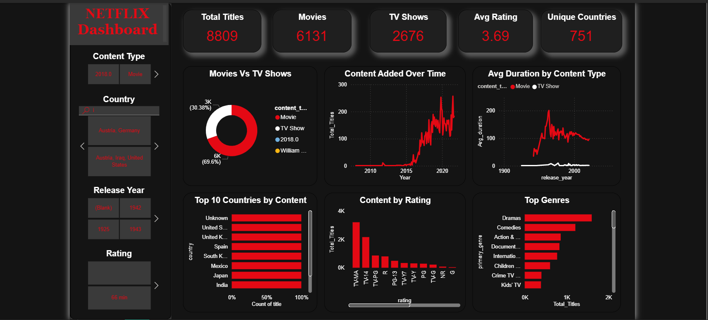

🎬 Netflix Content Analysis Dashboard

📌 Project Overview

This project analyzes Netflix movies and TV shows to understand content distribution, growth trends, genre dominance, and rating patterns.
The analysis uses Python for data cleaning and transformation and Power BI for interactive visualization.

🎯 Objectives

Analyze Movies vs TV Shows distribution

Identify content growth trends over time

Understand country-wise and genre-wise content availability

Analyze ratings and duration patterns

🛠 Tools & Technologies

Python (Pandas,Numpy) – Data cleaning & feature engineering

Power BI – Dashboard creation, KPIs, and visual analysis

📂 Dataset

Source: Kaggle (Netflix Movies and TV Shows dataset)

Contains information such as title, type, country, release year, rating, duration, and genres

🔄 Data Cleaning & Preparation

Performed using Python:

Removed duplicate records

Handled missing values

Converted date fields to proper datetime format

Created new columns:

year_added – year content was added to Netflix

primary_genre – extracted main genre

duration_minutes – numeric duration for analysis

Cleaned data was exported and used in Power BI.

📊 Key KPIs

Total Titles

Total Movies

Total TV Shows

Unique Countries

Average Rating

📈 Dashboard Insights

Movies dominate Netflix content, but TV shows have increased in recent years

Content additions peaked in recent years, showing platform growth

The US and India are top content-producing countries

Drama and Comedy are the most common genres

Majority of content targets mature audiences

## 📊 Power BI Dashboard Preview

📁 Project Structure
netflix-content-analysis/
│
├── data/
│   └── cleaned_netflix_data.csv
│
├── python/
│   └── netflix_data_analysis.ipynb
│
├── powerbi/
│   └── netflix_content_dashboard.pbix
│
├── dashboard_preview.png
│
└── README.md

📌 Conclusion

This project demonstrates end-to-end data analytics skills, including data preprocessing, KPI creation, and dashboard storytelling using Python and Power BI.

👩‍💻 Author

Bohdad Sheerin
Aspiring Data Analyst | Python | SQL | Power BI
